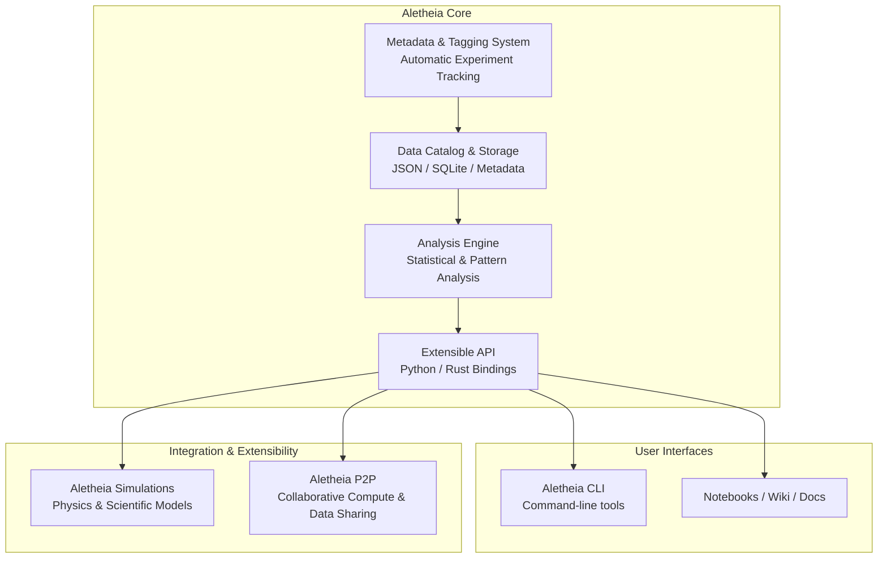

# 🛠️ Aletheia – The Lab of Truth

> Decentralized, open-source platform for scientific exploration and experimentation.

---

## ⚡ Mission
- Collect, catalog, and analyze experimental data  
- Enable modular simulations and scientific workflows  
- Support decentralized collaboration via P2P network

---

## 🧩 Core Projects

| Project | Purpose |
|---------|---------|
| **[Aletheia Core](projects/core.md)** | Data catalog, analysis engine, extensible API |
| **[Aletheia CLI](projects/cli.md)** | Command-line tools for interacting with Core |
| **[Aletheia Simulations](projects/simulations.md)** | Physics-based simulations and modeling |
| **[Aletheia P2P](projects/p2p.md)** | Decentralized collaboration and compute sharing |

---

## 🚀 Architecture – Aletheia Core

